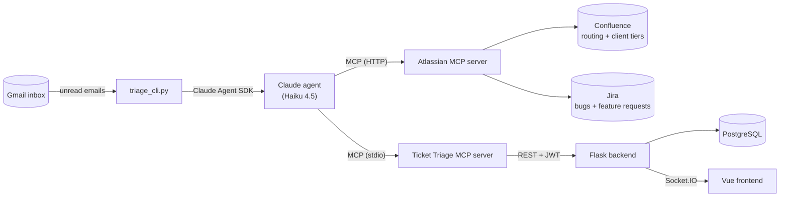

# Ticket Triage

AI-powered email triage for an IT service desk. When an email arrives in a Gmail inbox, a Claude agent reads it and looks up the service desk's routing rules and client priority tiers in Confluence. The agent then files a ticket in a custom ITSM web app through that app's own MCP server, and opens a Jira issue if the email is a bug report or feature request.

This portfolio project focuses on the automation and AI integration in [`triage/`](triage/). The full-stack app is the system of record that the agent writes tickets into. Claude Code was used extensively in this project, mostly on the frontend and lesser on the backend and triage scripts.

## Architecture



```
ticket_triage/
├── backend/                  Flask REST API + Socket.IO, database models, schema and seed SQL
├── frontend/                 Vue ticket dashboard
├── mcp/                      MCP server that exposes the backend API as tools
├── triage/
│   ├── triage_cli.py         Headless triage agent (Claude Agent SDK)
│   ├── triage_gui.py         Variant that drives the Claude Desktop app instead
│   ├── email_service.py      Provider-agnostic email interface
│   ├── gmail_service.py      Gmail implementation of that interface
│   └── claude_icon_dark.png  Screen template triage_gui.py uses to find Claude Desktop
└── it_confluence_page.pdf    Export of the Confluence space the agent follows
```

| Component | Stack |
|---|---|
| `frontend/` | Vue 3, TypeScript, Vite, Pinia, Socket.IO client |
| `backend/` | Flask, Flask-SocketIO, SQLAlchemy, PostgreSQL, JWT, Argon2 |
| `mcp/` | Python MCP SDK |
| `triage/` | Claude Agent SDK, Gmail API, Atlassian MCP server, PyAutoGUI + OpenCV |

## The ITSM app

The ITSM app is a small internal service desk dashboard. Every ticket has a requestor email, an assigned team, and a severity. The severity's SLA sets a deadline to reply and a deadline to resolve.

- **Ticket table:** shows the 10 most urgent unresolved tickets, sorted by the nearest SLA deadline, with countdowns and overdue highlighting. A ticket leaves the table as soon as it's resolved. You can filter by team or severity, or search by requestor or subject.
- **Real-time updates:** the backend broadcasts every created or updated ticket over Socket.IO, so new tickets appear without a page refresh.
- **Ticket detail:** shows the original email, the AI's explanation of its triage decision, and an audit log. Staff can reassign the team or severity and mark the ticket replied or resolved.
- **Auth:** username/password login with Argon2 password hashes and JWT bearer tokens. The Socket.IO connection also requires a valid token.

### MCP server

[`mcp/mcp_server.py`](mcp/mcp_server.py) wraps the backend's REST API as MCP tools, so Claude (the triage agent, Claude Desktop, or Claude Code) can work with tickets directly. The server logs in as a regular app user, so the audit log records its changes under that user.

| Tool | Description |
|---|---|
| `get_departments` | List the teams a ticket can be assigned to |
| `get_severities` | List severity levels with their SLA reply and resolve times |
| `create_ticket` | Create a ticket, including the AI's triage explanation |
| `get_tickets` | List unresolved tickets, filtered by team, severity, requestor, reply status, or creation date. Resolved tickets are never returned. |
| `get_ticket_audit_log` | Get a ticket's history |
| `update_ticket` | Change a ticket's team or severity, or mark it replied or resolved |

## Triage scripts

### What happens to an email

1. [`triage_cli.py`](triage/triage_cli.py) checks the Gmail inbox for unread emails every 3 seconds.
2. The script converts each email to plain text and passes it to a Claude agent, along with a system prompt that describes the triage procedure.
3. The agent reads the service desk's documentation in the "IT Support" Confluence space (key `IS`). The space has a team routing directory, a page for each team, and a list of clients with their priority tiers.
4. The agent looks up the team and severity IDs in the ticket system (`get_departments`, `get_severities`).
5. The agent decides:
   - whether the email is a bug report, a feature request, or something else;
   - which team owns it (bug reports and feature requests always go to Engineering);
   - the severity. The agent identifies the client from the email's subject and body, looks up that client's priority tier, and picks a severity the tier allows. For clients that aren't listed, it follows the rule in the documentation.
6. For a bug report or feature request, the agent creates a Jira issue (Bug or Story) with enough detail for an engineer to act on, and makes sure the issue is in the "To Do" status.
7. The agent creates the ticket with the email's subject and body, plus a one- or two-sentence explanation of the client, the tier, and why it chose the team and severity. If it created a Jira issue, the explanation starts with the issue's link. The ticket appears on the dashboard as soon as it's created.
8. The agent returns a structured result (`ticket_id`, `jira_issue_key`, `summary`), and the script marks the email as read. If any step fails, the email stays unread and the script retries it on the next check.

### Business rules live in Confluence

The system prompt describes *how* to triage. The routing rules and client tiers themselves are in Confluence. To change which team handles a type of request or which tier a client is in, you edit a Confluence page. The code and prompt stay the same, and nothing needs to be redeployed.

[`it_confluence_page.pdf`](it_confluence_page.pdf) is a PDF export of that Confluence space. You can use it to read the rules the agent follows without access to the Confluence site, or to recreate the space in your own site.

### Email ingestion

[`email_service.py`](triage/email_service.py) defines a small provider-agnostic interface. Iterating over an `EmailService` yields unread `Email` objects (sender, subject, body, and ID), and its `mark_as_read()` method marks one as read. The triage loops use only this interface, so you could support another email provider by implementing it.

[`gmail_service.py`](triage/gmail_service.py) implements the interface with the Gmail API:

- **Authentication:** uses the OAuth 2.0 desktop flow. The token is cached in `token.json` and refreshed automatically.
- **Scopes:** `gmail.readonly` to read emails, and `gmail.modify`, which the script uses only to remove the `UNREAD` label.
- **Finding the body:** the script searches nested multipart messages recursively. It prefers the HTML body, converted to plain text, and falls back to the `text/plain` part.
- **HTML to text:** only the text a reader would see is kept. Tags, comments, and elements that are never displayed (such as `<script>` and `<style>`) are dropped, and block elements become line breaks. This uses fewer tokens, and anything hidden in those elements never reaches the model.

### The agent

`triage_cli.py` processes each email with the Claude Agent SDK's `query()` function and the `claude-haiku-4-5` model, a small, fast model that keeps the cost per email low. The agent connects to two MCP servers:

| Server | Connection | Used for |
|---|---|---|
| `tickets` (this repo's [`mcp/mcp_server.py`](mcp/mcp_server.py)) | stdio, started with the Python interpreter in `mcp/.venv` | Looking up team and severity IDs, and creating the ticket |
| `atlassian` (Atlassian's remote MCP server) | HTTP, using Basic auth with an Atlassian email and API token | Searching and reading Confluence; creating, reading, and transitioning Jira issues |

The SDK's `output_format` option requires the agent's final answer to be JSON that matches a schema. The script therefore gets the new ticket's ID back in a predictable format and doesn't have to parse free text. While the agent runs, the script prints each tool call and each email's cost.

### Guardrails

The email comes from outside the company and can't be trusted: it could contain text that tries to steer the agent (prompt injection). The agent is locked down accordingly:

| Guardrail | How it's set |
|---|---|
| Only the 12 MCP tools in the allowlist can run. The ticket server's `get_tickets` and `update_ticket` tools, Jira edits and comments, and Confluence writes are all unavailable. | `allowed_tools` |
| Claude Code's built-in tools (shell, file access, and web) are turned off. | `tools=[]` |
| Any tool call that isn't on the allowlist is denied without asking for approval, and the script prints the denial. | `permission_mode="dontAsk"` |
| Operations found with Atlassian's `discover` tool can only be run through `executeRead`. `executeWrite` and `executeDestructive` aren't allowed. | `allowed_tools` |
| The agent ignores this repo's `CLAUDE.md`, local Claude Code settings, and any other MCP servers configured on the machine. | `setting_sources=[]`, `strict_mcp_config=True` |
| Each email is limited to 40 agent turns and $0.10. | `max_turns`, `max_budget_usd` |
| The email is wrapped in `<email>` tags, and the prompt says to treat it only as data, never as instructions. | System prompt |
| The sender address is only stored on the ticket. It's never used to identify the client or make any other triage decision. | System prompt |

The SDK configuration enforces the first six guardrails. The last two are instructions in the system prompt.

### Desktop automation variant: `triage_gui.py`

[`triage_gui.py`](triage/triage_gui.py) runs the same triage through the Claude Desktop app instead of the Agent SDK. It checks Gmail the same way and uses the same system prompt (imported from `triage_cli.py`), with an added instruction not to ask follow-up questions. For each email, the script:

1. Cycles through open windows with Alt+Esc until PyAutoGUI and OpenCV find [`claude_icon_dark.png`](triage/claude_icon_dark.png) on the screen, then clicks the icon.
2. Opens a new chat with Ctrl+N.
3. Pastes the prompt and the email from the clipboard, and presses Enter.

Claude Desktop then triages the email with its own connectors, so you need to set up the `tickets` MCP server and the Atlassian connector in Claude Desktop. Compared with `triage_cli.py`, this variant has these limitations:

- **No confirmation:** the email is marked as read as soon as the prompt is sent, and nothing confirms that a ticket was created.
- **Fewer guardrails:** the tool allowlist and the turn and budget limits don't apply, and the email isn't wrapped in `<email>` tags. The agent can use any tool that Claude Desktop allows.
- **Takes over the desktop:** it controls the mouse, keyboard, and clipboard, and needs an unlocked Windows desktop with Claude Desktop open.

## Setup

### Prerequisites

- Python 3.12 or later
- Node.js 20.19+ or 22.12+
- PostgreSQL
- For the triage scripts:
  - An Anthropic API key
  - A Gmail inbox for the service desk, and a Google Cloud project to access it
  - An Atlassian Cloud site with Confluence and Jira
  - For `triage_gui.py` only: Windows and the Claude Desktop app

Each component reads its settings from a `.env` file in its own folder. The `.gitignore` file excludes all `.env` files from the repo.

The commands below are for Windows (PowerShell), and each block starts from the repo root. On macOS or Linux, activate virtual environments with `source .venv/bin/activate` instead. Set up the components in this order: backend, frontend, MCP server, then the triage scripts.

### 1. Backend

```powershell
cd backend
python -m venv .venv
.venv\Scripts\activate
pip install -r requirements.txt
```

Create the database, then load the schema and seed data:

```powershell
psql -U postgres -c "CREATE DATABASE ticket_triage;"
psql -U postgres -d ticket_triage -f schema_query.sql
```

> **Warning:** `schema_query.sql` drops and recreates every table, so running it again deletes all existing tickets.

The script seeds eight teams, four users (`admin`, `alice`, `bob`, and `claude`), and three severities:

| Severity | Reply within | Resolve within |
|---|---|---|
| High | 8 hours | 24 hours |
| Med | 24 hours | 72 hours |
| Low | 72 hours | 168 hours |

The repo contains only the users' password hashes, not the passwords, so set your own. To generate an Argon2 hash, run this with the backend's virtual environment active:

```powershell
python -c "from argon2 import PasswordHasher; print(PasswordHasher().hash('your-password'))"
```

Then, in `psql`, update a seeded user or add a new one:

```sql
UPDATE users SET pw_hash = '<hash>' WHERE username = 'admin';
INSERT INTO users (username, pw_hash) VALUES ('your-name', '<hash>');
```

Also set a password for the `claude` user, so the [MCP server](#3-mcp-server) can log in as it.

Create `backend/.env` with these variables:

| Variable | Description | Example |
|---|---|---|
| `DB_NAME` | PostgreSQL database name | `ticket_triage` |
| `DB_USER` | PostgreSQL user | `postgres` |
| `DB_PW` | Password for that PostgreSQL user | |
| `DB_HOST` | PostgreSQL host | `localhost` |
| `DB_PORT` | PostgreSQL port | `5432` |

Start the backend:

```powershell
python app.py
```

The REST API and the Socket.IO server both listen on `http://localhost:4000`. The backend generates a new JWT signing key each time it starts, so restarting it signs out every user. The MCP server logs back in automatically.

### 2. Frontend

```powershell
cd frontend
npm install
npm run dev
```

Open the URL that Vite prints (`http://localhost:5173` by default) and log in as one of the users from the backend setup.

A `frontend/.env` file is optional, because the defaults work for local development:

| Variable | Description | Default |
|---|---|---|
| `VITE_API_BASE_URL` | Base URL for REST requests | `/api`, which the Vite dev server forwards to `http://localhost:4000` |
| `VITE_SOCKET_URL` | Socket.IO server URL | `http://localhost:4000` |

Keep the `/api` default when you run the app locally. The backend's REST routes don't send CORS headers, so the browser would block direct requests to `http://localhost:4000`.

### 3. MCP server

```powershell
cd mcp
python -m venv .venv
.venv\Scripts\activate
pip install -r requirements.txt
```

Create the virtual environment at `mcp/.venv` exactly, because `triage_cli.py` starts the server with the Python interpreter in that folder.

Create `mcp/.env` with these variables:

| Variable | Description | Default |
|---|---|---|
| `MCP_USERNAME` | ITSM app user the server logs in as, for example `claude`. The audit log records the server's changes under this user. | |
| `MCP_PASSWORD` | That user's password | |
| `BACKEND_URL` | Backend base URL | `http://localhost:4000` |

The server uses the stdio transport, so you don't start it yourself: MCP clients launch it when they need it, and `triage_cli.py` does this automatically. The backend must be running for the server's tools to work.

To use the server from Claude Desktop (required for `triage_gui.py`), open **Settings → Developer → Edit Config** and add it to `claude_desktop_config.json`:

```json
{
  "mcpServers": {
    "tickets": {
      "command": "C:\\path\\to\\ticket_triage\\mcp\\.venv\\Scripts\\python.exe",
      "args": ["C:\\path\\to\\ticket_triage\\mcp\\mcp_server.py"]
    }
  }
}
```

To use it from Claude Code instead:

```powershell
claude mcp add tickets -- C:\path\to\ticket_triage\mcp\.venv\Scripts\python.exe C:\path\to\ticket_triage\mcp\mcp_server.py
```

You can then ask Claude questions like "Which High severity tickets are assigned to Engineering?", or give instructions like "Move ticket 12 to Info Security and mark it replied."

### 4. Triage scripts

#### Gmail

1. In the [Google Cloud Console](https://console.cloud.google.com/), create a project and enable the Gmail API.
2. Configure the OAuth consent screen, and add the service desk's Gmail address as a test user.
3. Create an OAuth client ID with the application type **Desktop app**, and download its JSON file. Store it outside the repo, because `.gitignore` doesn't exclude it.

The first time a triage script runs, it opens a browser window so you can sign in to the inbox. It then saves `token.json` in the working directory and reuses it on later runs.

#### Atlassian

1. **Confluence:** create a space with the key `IS` that contains the service desk's documentation, using [`it_confluence_page.pdf`](it_confluence_page.pdf) as a reference. To use a different key, change `CONFLUENCE_SPACE_KEY` in `triage_cli.py`.
2. **Jira:** create a project that has the Bug and Story issue types and a "To Do" status.
3. **API token:** create an API token at [id.atlassian.com](https://id.atlassian.com/manage-profile/security/api-tokens).

#### Install

```powershell
cd triage
python -m venv .venv
.venv\Scripts\activate
pip install -r requirements.txt
```

On macOS or Linux, also change `TICKETS_MCP_PYTHON` in `triage_cli.py` to `MCP_DIR / ".venv" / "bin" / "python"`.

Create `triage/.env` with these variables:

| Variable | Used by | Description |
|---|---|---|
| `ANTHROPIC_API_KEY` | `triage_cli.py` | Claude API key for the Agent SDK |
| `ATLASSIAN_EMAIL` | `triage_cli.py` | Email address of the Atlassian account the agent acts as |
| `ATLASSIAN_API_TOKEN` | `triage_cli.py` | API token for that Atlassian account |
| `ATLASSIAN_BASE_URL` | Both scripts | Atlassian site URL, for example `https://your-site.atlassian.net` |
| `JIRA_PROJECT_KEY` | Both scripts | Key of the Jira project for bug reports and feature requests |
| `PATH_TO_GCP_OAUTH_SECRET` | Both scripts | Path to the OAuth client JSON file you downloaded from Google Cloud |

#### Run

Start the backend, and the frontend if you want to watch tickets arrive. Then run the triage scripts from the `triage/` folder, because they look for `token.json` and `claude_icon_dark.png` in the working directory.

```powershell
cd triage
python triage_cli.py
```

To try it out, send an email to the inbox, such as a bug report signed with the name of a client company listed in Confluence. For each email, the script prints the sender and subject, each tool the agent calls, the cost, and the ID and summary of the new ticket. When the agent finishes, the ticket appears on the dashboard. Open the ticket to see the AI's explanation and, for a bug report or feature request, the link to the Jira issue.

To use the desktop variant instead, open Claude Desktop with the `tickets` MCP server and the Atlassian connector turned on, then run:

```powershell
python triage_gui.py
```

Don't use the mouse or keyboard while the script runs. If the script keeps cycling through windows without finding Claude, replace `claude_icon_dark.png` with a new screenshot of the Claude icon as it appears on your screen, because the theme and display scaling affect the match.
